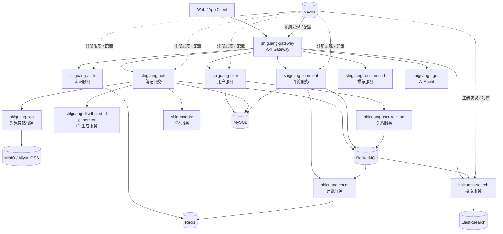
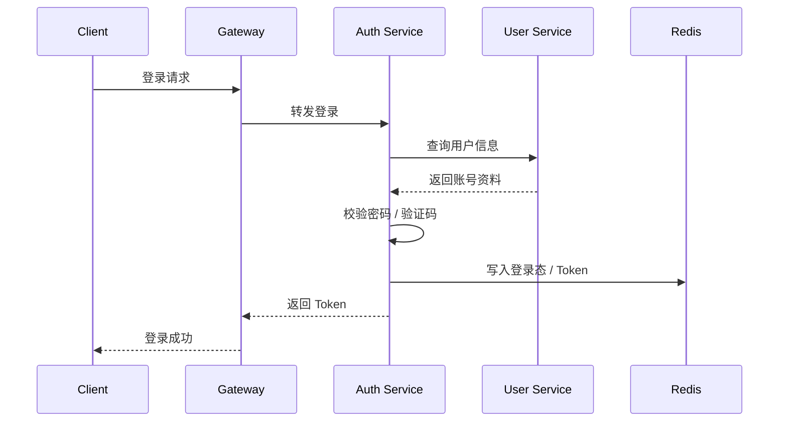
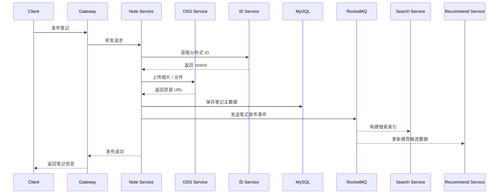
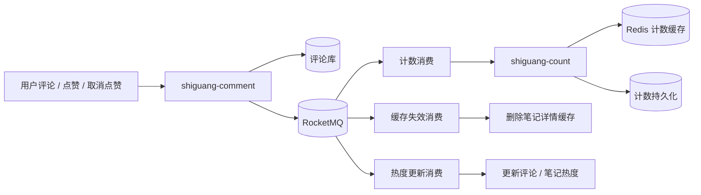
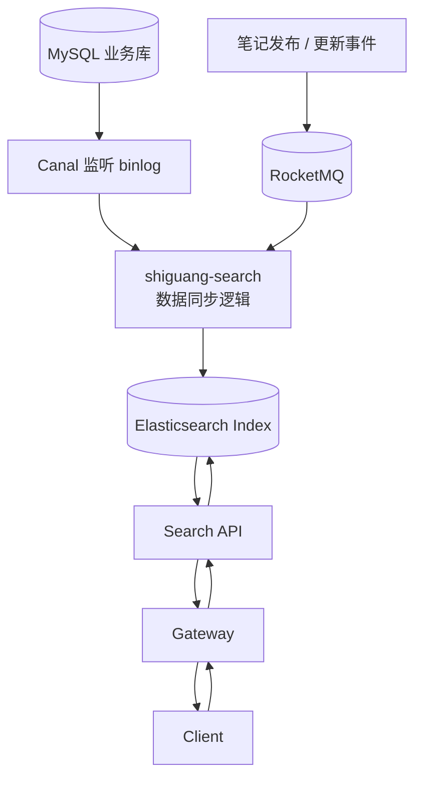
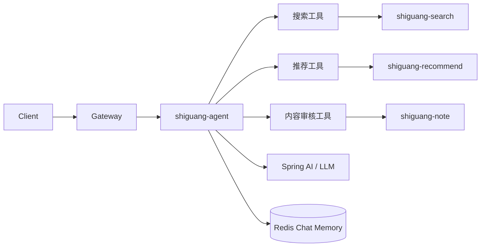
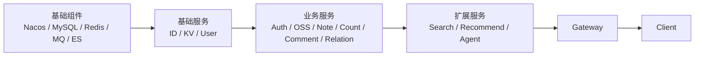

# 拾光 shiguang

拾光是一个生活内容社区后端项目，基于 Spring Cloud Alibaba 构建。项目围绕用户、认证、笔记、评论、点赞计数、关注关系、搜索、推荐、对象存储和 AI Agent 等场景拆分微服务，重点覆盖内容社区常见的高并发写入、异步削峰、缓存加速、搜索索引、数据同步和服务治理能力。

这个仓库适合作为微服务项目实战、后端架构学习、面试项目沉淀和二次开发基础。

## 核心能力

- 用户体系：注册登录、验证码、密码更新、用户资料、用户权限上下文。
- 内容发布：笔记发布、笔记查询、图片上传、内容状态管理。
- 社区互动：评论、点赞、收藏、关注、粉丝列表、互动计数。
- 搜索能力：基于 Elasticsearch 构建笔记搜索、用户搜索和搜索建议。
- 推荐能力：推荐服务独立拆分，支持个性化内容分发扩展。
- 异步处理：通过 RocketMQ 解耦评论、计数、缓存删除、数据同步等链路。
- 缓存体系：Redis 承担热点数据、登录态、布隆过滤、计数等缓存场景，Caffeine 用于本地缓存。
- 对象存储：支持 MinIO 和阿里云 OSS，统一承接图片和文件上传。
- 数据同步：结合 Canal、MQ、定时任务等机制维护搜索索引和冗余数据一致性。
- AI Agent：提供 AI Agent 服务，用于内容理解、内容审核、搜索总结和创作辅助等扩展场景。

## 技术栈

| 类型 | 技术 |
| --- | --- |
| 基础框架 | Java 17、Spring Boot 3.0.2、Spring Cloud 2022.0.0 |
| 微服务生态 | Spring Cloud Alibaba、Nacos、OpenFeign、Gateway |
| 数据存储 | MySQL、Redis、Elasticsearch |
| 消息与同步 | RocketMQ、Canal、XXL-JOB |
| 权限认证 | Sa-Token |
| ORM 与工具 | MyBatis、Druid、MapStruct、Lombok、Hutool、Guava |
| 缓存 | Redis、Caffeine |
| 文件存储 | MinIO、Aliyun OSS |
| AI 能力 | Spring AI |
| 构建工具 | Maven 多模块工程 |

## 整体架构



## 核心业务流程

### 登录认证流程



### 笔记发布流程



### 评论与计数异步链路



### 搜索数据同步流程



### AI Agent 调用链路



## 模块说明

| 模块 | 说明 |
| --- | --- |
| `shiguang-framework` | 公共基础框架、通用工具、上下文组件和业务 starter |
| `shiguang-gateway` | API 网关服务，承接统一入口、路由转发和认证上下文传递 |
| `shiguang-auth` | 登录认证、验证码、密码更新、短信发送和 Token 管理 |
| `shiguang-user` | 用户注册、用户资料、账号信息和用户查询 |
| `shiguang-note` | 笔记发布、笔记查询、笔记状态、可见性和内容主链路 |
| `shiguang-comment` | 评论发布、删除、分页查询、评论点赞和评论热度 |
| `shiguang-count` | 用户、笔记、评论等计数能力 |
| `shiguang-user-relation` | 关注、取关、粉丝列表、关注列表和关系缓存 |
| `shiguang-kv` | 通用 KV 存储服务 |
| `shiguang-distributed-id-generator` | 分布式 ID 生成服务 |
| `shiguang-oss` | 文件上传，支持 MinIO 和阿里云 OSS |
| `shiguang-search` | Elasticsearch 搜索、索引构建、搜索建议和数据同步 |
| `shiguang-recommend` | 个性化推荐服务 |
| `shiguang-data-align` | 数据同步、补偿和对齐任务 |
| `shiguang-agent` | AI Agent 服务，扩展内容理解、审核、总结和辅助创作 |
| `shiguang-benchmark` | 性能测试、算法验证和基准测试 |

## 目录结构

```text
shiguang
├── shiguang-framework
├── shiguang-gateway
├── shiguang-auth
├── shiguang-user
├── shiguang-note
├── shiguang-comment
├── shiguang-count
├── shiguang-user-relation
├── shiguang-kv
├── shiguang-distributed-id-generator
├── shiguang-oss
├── shiguang-search
├── shiguang-recommend
├── shiguang-data-align
├── shiguang-agent
└── shiguang-benchmark
```

## 本地环境

建议准备以下基础组件：

- JDK 17
- Maven 3.8+
- MySQL
- Redis
- Nacos
- RocketMQ
- Elasticsearch
- Canal
- MinIO 或阿里云 OSS

不同服务依赖的中间件不完全相同，可以按需要单独启动对应模块。

## 配置说明

项目配置主要位于各服务的：

```text
src/main/resources/config/
```

常见配置文件：

- `application.yml`
- `application-dev.yml`
- `application-prod.yml`
- `bootstrap.yml`

涉及云服务密钥时，不要把真实密钥写入 Git。推荐通过环境变量或部署平台的 Secret 管理能力注入：

```bash
ALIYUN_ACCESS_KEY_ID=your-access-key-id
ALIYUN_ACCESS_KEY_SECRET=your-access-key-secret
ALIYUN_OSS_ACCESS_KEY=your-oss-access-key
ALIYUN_OSS_SECRET_KEY=your-oss-secret-key
```

## 构建项目

在项目根目录执行：

```bash
mvn clean package -DskipTests
```

只构建指定模块及其依赖：

```bash
mvn clean package -pl shiguang-auth -am -DskipTests
```

## 启动服务

先启动依赖的中间件和注册配置中心，再按业务依赖启动各服务。常见启动顺序可以参考：



推荐顺序：

1. Nacos、MySQL、Redis、RocketMQ、Elasticsearch、Canal、MinIO
2. `shiguang-distributed-id-generator`
3. `shiguang-kv`
4. `shiguang-user`
5. `shiguang-auth`
6. `shiguang-oss`
7. `shiguang-note`
8. `shiguang-count`
9. `shiguang-comment`
10. `shiguang-user-relation`
11. `shiguang-search`
12. `shiguang-recommend`
13. `shiguang-agent`
14. `shiguang-gateway`

单个 Spring Boot 服务可以在对应模块目录下启动：

```bash
mvn spring-boot:run
```

## 适合展示的项目亮点

- 微服务边界清晰：按内容社区核心领域拆分服务，接口层和业务层职责明确。
- 高并发场景覆盖完整：评论、点赞、计数、关注等链路具备缓存、异步和削峰设计。
- 搜索链路独立：业务写入和搜索索引构建解耦，便于扩展重建索引、搜索建议和排序策略。
- 数据一致性有补偿思路：通过 MQ、Canal、定时任务和数据对齐服务处理最终一致性。
- 可扩展性强：推荐、AI Agent、Benchmark 单独拆分，方便扩展算法、模型和评测能力。

## 安全注意事项

- 不要提交真实数据库密码、Redis 密码、阿里云 AccessKey、OSS Secret 等敏感信息。
- `target/`、日志文件、IDE 配置和构建产物不应进入 Git。
- 本地开发建议使用 `dev` 配置，生产部署使用独立的配置中心或 Secret 管理。
- 如果 GitHub Push Protection 拦截推送，需要从提交历史中彻底移除密钥，而不是只修改最新文件。
